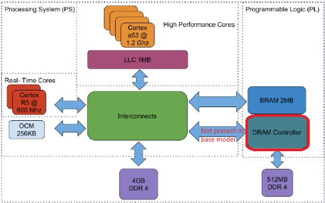
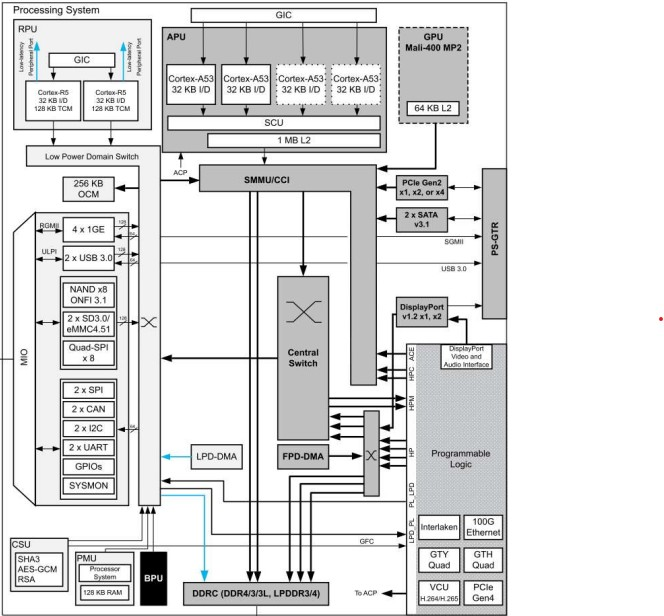

# AV RTOS (ARM)

- [Context](#context)
- [Problem Statement](#problem-statement)
- [Envisioned Solution](#envisioned-solution)
- [Hypothesis](#hypothesis)
- [Methodology](#methodology)
- [Schedule](#schedule)
- [Progress Tracking](#progress-tracking)
- [Reporting](#reporting)
- [Bibliography](#bibliography)

## Context

- **In which field is my research inserted?**

    This research is in the field of Cyber-Physical System (CPS) Security. It specifically focuses on integrating embedded systems security, real-time operating systems (RTOS), and machine learning (ML) on ARM architectures.

- **Why is it relevant?**

    This research is relevant because RTOS-based embedded systems are crucial for safety-critical applications like industrial control, medical devices, and autonomous vehicles. A security breach in one of these systems could have catastrophic consequences. The ability to detect and isolate threats in real-time, without compromising the determinism of the RTOS, is fundamental.

- **What open problems are still there in the field? (Check national agency websites like NSF, EC, CNRS, and recent surveys in top journals for hints.)**

    There are several open problems in the field, including:

    - Shared-Resource Contention: The execution of multiple tasks on multicore platforms often leads to shared-resource contention, which may impair the execution of software components. This can affect the behavior observed through Performance Monitoring Counters (PMC).

    - IOMMU Interference: The role of the Input-Output Memory Management Unit (IOMMU) in performance interference is largely unexplored, and its shared architectural properties can introduce unpredictable timing delays.

    - Microarchitectural Vulnerabilities: Speculative execution implementations violate the security assumptions of software and can be exploited by attacks like Spectre to read confidential information.

    - Virtualization Overhead: While virtualization is a key technology for isolation, it cannot fully guarantee temporal isolation in mixed-criticality systems due to shared microarchitectural resources like the Last-Level Cache (LLC) and system bus. This poses a challenge for ensuring strict Worst-Case Execution Time (WCET) guarantees for real-time systems.

- **Which of these problems am I going to address in this article?**

    This research will address the problem of real-time attack detection on resource-constrained embedded systems while guaranteeing system integrity and security through hardware-level isolation. The project uses Performance Monitoring Unit (PMU) counters to achieve this. The machine learning model will analyze data from these counters to profile the normal behavior of the RTOS, and then detect deviations that could signal an attack. This approach directly addresses the challenge of building an effective intrusion detection system (IDS) on multicore embedded platforms. The project aims to overcome the specific challenges highlighted in existing research, including:

    - Mitigating the impact of shared-resource contention on the reliability of ML-based IDS, which has been shown to cause significant accuracy drops.

    - Preventing microarchitectural vulnerabilities like Spectre attacks from being exploited, which rely on a lack of proper isolation between processes.

    - Minimizing the latency and overhead of virtualization while still providing strong isolation for a real-time operating system (RTOS) on an ARM architecture.

- **How have others addressed this problem so far? (Start building your bibliography.) - What results have others achieved so far?**

    A fault injection framework for real-time multicore embedded systems developed by Horstmann and Fröhlich (2020) demonstrated the ability to simulate faulty behaviors with a maximum execution time overhead on the system of 0.1001% and an average task activation jitter not higher than 5.0096µs. A study on intrusion detection systems (IDS) by Horstmann and Fröhlich (2024) showed that a lack of proper resource isolation can lead to the IDS losing the ability to recognize the behavior of a target software component. In one instance, an accuracy drop of nearly 74% was noticed due to the interference caused by shared-resource contention. Additionally, research into IOMMU interference by Costa, Martins, and Pinto (2025) found that contention effects can delay DMA transactions by up to 1.79x for smaller transfers on the Arm SMMUv2 implementation. This is particularly impactful for small memory transactions where translation overheads are significant. Finally, other research by Kocher et al. (2019) demonstrated that Spectre attacks can exploit speculative execution to read arbitrary memory from a victim's process, with these vulnerabilities found in microprocessors from Intel, AMD, and ARM.

- **What is still missing?**

    What is still missing is the integration of a lightweight and efficient machine learning (ML) model with a bare-metal hypervisor to monitor an RTOS. This research gap exists because while hypervisors are known for enforcing isolation, and ML is used for security, they haven't been combined in a single, secure solution that also accounts for the real-time constraints and performance of an RTOS. The project will demonstrate a system that offers both real-time anomaly detection and robust hardware-enforced security without sacrificing the critical performance of the RTOS.

## Problem Statement

- **Summarize the previous paragraphs in a single, strong, concise, complete, robust statement.**
  
    This research aims to solve the problem of detecting and mitigating cyberattacks in real-time embedded systems with RTOS on ARM architectures. The central challenge is that existing solutions for intrusion detection are vulnerable to shared-resource contention and microarchitectural attacks like Spectre, and they often lack the robust hardware-level isolation needed for safety-critical systems. While virtualization can provide isolation, it introduces performance overhead that can compromise the deterministic behavior of an RTOS. Therefore, a gap exists for a solution that effectively combines a real-time, machine-learning-based detection model with a bare-metal hypervisor to provide both low-latency security and guaranteed performance on a single platform.

## Envisioned Solution

- **How do you think you can solve the problem modeled above?**

    The project would solve the problem by implementing a hardware-level security framework that combines a bare-metal hypervisor with a machine learning (ML) model analyzing Performance Monitoring Unit (PMU) counters.

    The Role of the Hypervisor:

    - The solution hinges on using a bare-metal hypervisor, such as Bao Hypervisor, to achieve strong hardware-enforced isolation. The hypervisor would partition the processing system (PS) of the Zynq UltraScale+ MPSoC, dedicating a core to run the RTOS for critical tasks and another isolated core to run the ML-based intrusion detection system. This virtualization approach directly addresses several key challenges:

        - **Isolation of Critical Tasks**: By running the RTOS in a secure, isolated domain, the hypervisor prevents a security breach in the ML model or other components from affecting the real-time, deterministic behavior of the RTOS.

        - **Mitigation of Microarchitectural Attacks**: The hypervisor's isolation helps to contain and mitigate attacks like Spectre, which exploit a lack of separation between processes.

        - **Resource Contention**: The hypervisor's partitioning of resources reduces the impact of shared-resource contention, which has been shown to cause significant drops in the accuracy of ML-based intrusion detection systems.

    The Role of Machine Learning and PMU Counters:

    - The ML model is the core of the intrusion detection system. It would be trained to recognize the system's normal behavior using a set of carefully selected PMU counters. These counters provide a low-overhead, real-time architectural "fingerprint" of the running software.

        - **Behavioral Modeling**: The ML model would be trained on data from PMU counters collected during a non-contending, "safe" execution of the RTOS tasks. This establishes a baseline of normal behavior.

        - **Real-time Detection**: During operation, the model would continuously analyze incoming PMU counter data for deviations from the established normal behavior. By operating in an isolated environment, it can perform this detection without its performance being compromised by contention from other tasks.

    This comprehensive approach solves the problem by providing a solution that is not only robust against hardware and software vulnerabilities but also capable of real-time threat detection with minimal impact on the performance of the critical RTOS.

- **Are you going to develop a formal proof?**

    The project's methodology is primarily empirical, focusing on implementation and evaluation rather than mathematical proofs. This involves building a framework on a real platform and then assessing its performance and effectiveness through a series of experiments.

    The project would:

    - Implement a solution using a hypervisor and a machine learning model on a physical platform.

    - Run micro-benchmarking and performance monitoring experiments to characterize the system's behavior.

    - Measure key metrics like execution time overhead and jitter to demonstrate that the approach doesn't disrupt the temporal characteristics of critical tasks.

    - Assess the impacts of the proposed solution on shared-resource contention and the ability of the ML model to recognize system behavior under interference.

    While formal proofs are a rigorous method for verifying system correctness, this project focuses on a practical, implementation-based approach to solving the problem.

- **Are you going to implement something and validate your solution experimentally? How exactly?**

  - We are currently studying how the vehicle performs its computational tasks and how we can integrate it with our ZF3 card. However, our goal is to port a least one task, currently running in the vehicle, to the ZF3. To correctly apply the concepts of MCS (Mixed Criticality Systems), we are going to run two separate systems, Linux-based and RTOS, and let a hypervisor handle the resource management. Then, use this environment to validate our initial hypothesis by testing different methods of attack to point out the vulnerability, and later apply a countermeasure.

- **Are you going to implement something and validate your solution experimentally? How exactly?**

    We are currently studying on how the vehicles performs its computational tasks and how we can integrate it with our FZ3 card, however, our goal is to port a least one task, currently running in the vehicle, to the FZ3. To correctly apply the concepts of MCS (Multi Criticality Systems) we're going to run two separate systems, Linux-based and RTOS, and let a hypervisor handle the resource management. Then, use this environment to validate our initial hypothesis, by testing different methods of attack to point out the vulnerability, and later apply a countermeasure.

- **Are you going to model your solution to run simulations? What exactly will you simulate? How will you achieve statistical significance to make your point?**

    We are going to run simulations on both emulators and FZ3 card. The top reasons are listed bellow:

    1. Due to limited hardware access, the emulator will server as a development tool which we can test if the code implementation can correctly express our intent;
    2. Run controlled simulations on the FZ3 card, initially without the FZ3-vehicle integration, so that we can evaluate the exploit and countermeasures.

## Hypothesis

The Performance Monitor Unit (PMU) continuously monitors the system performance metrics. Under normal execution conditions, those metrics would follow a stable pattern. An attacker usually use methods that causes an abnormal system load that can be measured by the PMU. A ML-based IDS could identify this abnormal system load and classify it as malicious attack, triggering a countermeasure to mitigate its impact on the system.

## Methodology

- **How are you going to demonstrate your hypothesis?**

    We going to demonstrate the hypothesis in three phases:

    1. Setup the FZ3 card, and explain its hardware resources, highlighting potential vulnerabilities if any;
    2. List a number of attack methods that are applicable to the FZ3 card and select some of them to demonstrate an attack; and
    3. Use the implemented IDS to identify the attacks.

- **Which assets do you already have?**
- Literature:
  
    - [Beyond the Bermuda Triangle of Contention: IOMMU Interference in Mixed Criticality Systems](https://arxiv.org/abs/2508.19670)
    - [On the Impacts of Shared-Resource Contention on Intrusion Detection Systems based on Performance Monitoring](https://ieeexplore.ieee.org/stamp/stamp.jsp?tp=&arnumber=8835233)
    - [On the Impacts of Shared-Resource Contention on Intrusion Detection Systems based on Performance Monitoring](https://ieeexplore.ieee.org/document/10551363)
    - [A Fault Injection Framework for Real-time Multicore Embedded Systems](https://ieeexplore.ieee.org/document/9277864)

- Tools, datasets, systems, algorithms, theorems, formulations by others:

    - Bao Hypervisor with dual guest (Linux + FreeRTOS).

- Previous works by the group (links to other experiments, reports, and papers):

    - Architecture Description: MYS‑ZU3EG‑8E4D‑EDGE‑K2 v11 or FZ3 Deep Learning Accelerator Card
        - Xilinx Zynq UltraScale+ ZU3EG MPSoC;
        - Application Processing Unit (APU): ARM Cortex-A53 up to 1.2GHz:
            - Quad-Core ARMv8-A Architecture;
            - 32 KB each Private L1 Instruction and Data Cache per core;
            - 1 MB Shared L2 Cache.
        - Real-Time Processing Unit (RPU): ARM Cortex-R5 up to 600MHz:
            - Dual-Core ARMv7-R Architecture;
            - 32 KB combined Private Instruction and Data Cache per core;
            - 128 KB Tightly Coupled Memory (TCM) per core.
        - Programmable Logic (PL);
        - ARM Mali-400 MP2 GPU (built into the Zynq UltraScale+ MPSoC) up to 667MHz;
        - Memory:
            - OCM: 256 KB On-Chip Memory (PS);
            - PS DRAM: 4 GB DDR4 (64-bit) up to 2400 MHz connected to PS;
            - PL BRAM: Programmable Logic Block RAM available inside the FPGA fabric;
            - PL DRAM: not present in base model.
        - Connectivity:
            - Two 2.54mm pitch 2x20-pin IO Expansion Interfaces;
            - 2 x USB2.0 Host;
            - 1 x CAN;
            - 1 x RS485;
            - 4 x PS_MIO, PL_IO (12 pairs x HD_IO, 8 pairs x HP_IO).
        - Storage:
            - eMMC Flash: 8 GB onboard nonvolatile;
            - QSPI Flash: 32 MB NOR Flash;
            - EEPROM: 32 KB for configuration and user data;
            - TF card interface.
        - Block Diagram:
            - Simplified Block Diagram of the UltraScale+ MPSoC (ZCU102) Adapted from: Bansal, Ayoosh, et al. "Evaluating memory subsystem of configurable heterogeneous MPSoC." Proceedings of the Operating Systems Platforms for Embedded Real-Time applications (2018).
            - 
            - XCZU3EG resources. Source: FZ3 Deep Learning Accelerator Card Hardware Manual Version V1.0 (https://www.myirtech.com/download/ZU3EG/FZ3_Deep_Learning_Accelerator_Card_Hardware_Manual.pdf)
            - 

- Skills:
    - programming languages: C, C++, Python.
    - scripting: bash, batch.
    - markup languages: Markdown, YAML, KaTex.
    - versioning tools: git.
    - CPU Architecture: Arm Cortex-M.
    - RTOS: FreeRTOS
    - serial protocols: I2C, SPI.

- **What is still missing?**

    - How to use the FZ3 card: platform setup.
    - Better understanding on how cache memories are implemented.
    - Better understanding on how MMU, IOMMU are implemented.
    - Better understanding of Arm Cortex-A and Cortex-R architectures. 

- **How will you tackle the missing elements?**

    - Arm CPU architecture documentation.
    - Check in the literature.
    - Search for more related works.
    - Ask to professor, assistant professor, or graduate that have a better understand on those topics.

- **What resources do I need?**

    TBD

- **Who can help me and how?**

    TBD

- **How long will it take?**

    TBD

## Schedule

Plan your work in weeks and keep a progress record. (x = work, D# = deadline/delivery)

Task|Sub task|W1|W2|W3|W4|W5|W6|W7|W8|W9|W10|W11|W12|W13|W14|W15|W16
|-|-|-|-|-|-|-|-|-|-|-|-|-|-|-|-|-|-|
|Scope||x|x|x|D1|||||||||||||
||Discuss Project Scope|x|x|x|D1|||||||||||||
||Create Repo|||x|D1|||||||||||||
||Search Related Work|||x|D1|||||||||||||
||Write Project Plan|||x|D1|||||||||||||
|Design|||||x|x|x|x|x|x|D2|||||||
|Integration|||||||||||x|x|x|D3||||
|Validation||||||||||||||x|x|x|D4|

## Progress Tracking

CODES:
WT = Writing Task; WD = Writing Done; WP = Writing Problems
CT = Coding Task; CD = Coding Done; CP = Coding Problems
RT = Review Task; RD = Review Done; RP = Review Problems
FT = Field Test Task; FD = Field Test Done; FP = Field Test Problem
PT = Planning and Discussion Tasks; PD = Planning and Discussion Done; PP = Planning and Discussion Problem
H = Help needed: what kind of help is required and expected time required (Email/Remote Meet/In-person meet).

----------------------------------------------------------------------
Date (dd/mm/yy) | Type | Description
----------------|------|----------------------------------------------------------
dd/mm/yy        | xT   | Planned task (a single line per task for each week).
dd/mm/yy        | xD   | Single-line description of each task finished this week (with links to assets).
dd/mm/yy        | xP   | Single-line description of tasks that could not be accomplished with reasons.
dd/mm/yy        | xH   | Expected Time Required: [details on help needed].

## Reporting

Create a document in Overleaf to collect results as you produce them. Remember your hypothesis: things not directly related, even if fundamental, do not usually get reported to avoid zig-zags.
Link: https://www.overleaf.com/learn/how-to/Creating_a_document_in_Overleaf

Capture your results as if they were finals (don't waste your time with draft figures, tables, graphics that must be remade later).
Link to git repository (for code): [URL]
Link to data repository (e.g., IoT platform, dataset storage): [URL]
Link to documents (e.g., seafile, drive): [URL]

Use Inkscape for figures.
Use 10pt sans-serif fonts for plottings and figures, on an A5 page (so you don't have to resize them for the paper).

## Bibliography

Link your bibliography (e.g., a BibTeX file or Zotero library) and write a paragraph for each paper explaining why it was relevant for your hypothesis. This can later be incorporated into the related works section of your article.

[Link to Bibliography File/Library]

Paper 1: [Citation]
Relevance: [Explain why this paper is relevant to your work...]

Paper 2: [Citation]
Relevance: [Explain why this paper is relevant to your work...]
